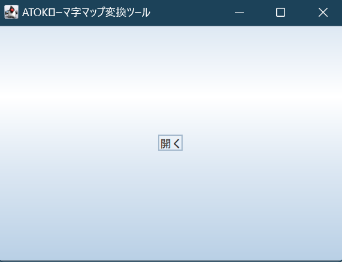

# ATOKローマ字マップ変換ツール
ATOKでローマ字カスタマイズ画面から出力できるローマ字マップのテキストファイルを**Google日本語入力用**でインポート可能なローマ字マップに変換するツールです。

## 使用方法
※ **事前準備**  
あらかじめATOKのローマ字カスタマイズ画面より、ローマ字マップをテキストファイルで出力してください。

ビルド後アプリケーションを起動すると、上の画像で示したようなメイン画面が表示されます。  
開くボタンを押して、事前に出力していたローマ字マップファイルを選択してください。  
ファイルを選択するとすぐに、保存先のファイル名を求められるので、任意のファイル名を入力して保存してください。  
保存が完了すると、Google日本語入力用のローマ字マップファイルが出力されます。

## 注意事項
- SHIFT-JISの変換のみに対応。
  - ATOKで書き出す際のデフォルト文字コードに合わせています
- 確認バージョン
  - ATOK: 33.0.5
  - Google日本語入力: 2.28.5050.0  
今後のバージョンアップにより、インポート・エクスポートの仕様が変更される可能性があります。
- 基本的にはATOKで書き出したテキストファイルをそのまま変換させてください。Google日本語入力でインポートするために加工しているので、手を加えてしまうとインポートできなくなるおそれがあります。
- Javaのビルド環境が必要です。JDK 17があれば確実ですが、特に外部ライブラリなどは使っていないため、どのバージョンでも基本的にはビルドできると思われます。
